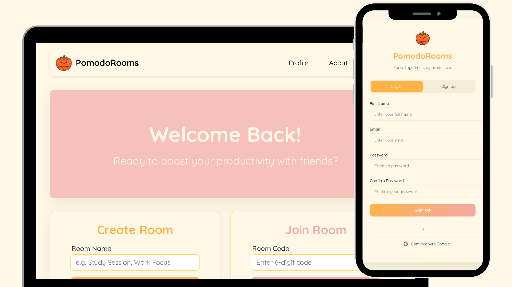

# ⏳ Pomodoro Rooms

> **Focus together, stay productive.**  
> A cozy, collaborative Pomodoro timer web app where you can work in real-time virtual rooms with friends or teammates.

---

## 📌 Overview

**Pomodoro Rooms** is a productivity app built with **React.js (Vite)** that lets you create or join virtual rooms for shared focus sessions.  
Based on the **Pomodoro Technique**, it helps you stay on track with alternating focus and break cycles, all while staying connected with others.

This project is currently **in development**, with plans to integrate **Firebase Authentication** and **Firestore** for real-time data.

---

## 🛠 Tech Stack

- **React.js (Vite)** – Frontend framework
- **Firebase** – Authentication, Firestore, real-time updates
- **CSS3** – Custom styling with soft shadows & rounded corners
- **Font Awesome** – Icons
